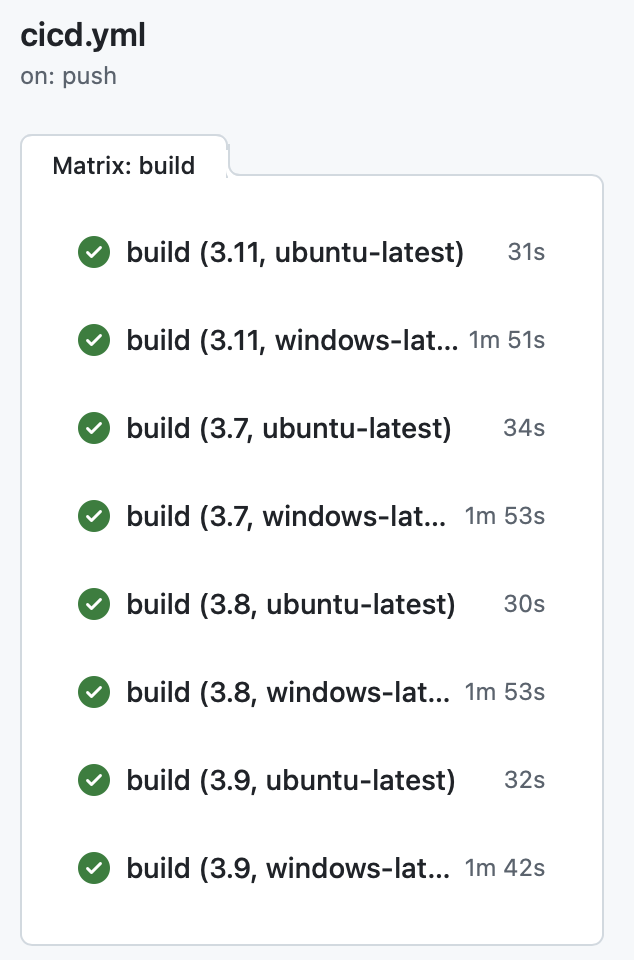
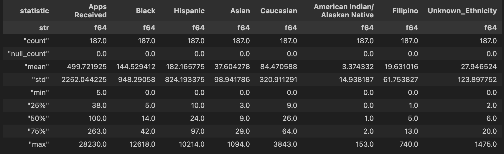

# Mini Project 4: GitHub Actions Matrix Build for Multiple Python Versions

In Project 4, I added GitHub Action Matrix to cicd.yml file, to test multiple python versions and environments in Github Actions. 

Note: Since Project 4 is built upon Project 3, the rest of Project 4 remains the same as Project 3.

***********************************

# Mini Project 3: Polars Script

## Project Purpose
The main purpose of this project is to create Polars script to analyze the job application data, including generating summary statistics and visualization chart.

## Project Data Source
The data used in this analysis comes from a dataset published by data.lacity.org on Data.Gov website, and the data version is as of September 15, 2023. You can find more information about data source via link here: https://catalog.data.gov/dataset/job-applicants-by-gender-and-ethnicity 

## Project Key Steps
1. Read job applicant csv file into dataframe.
2. Create statistic functions to summarize key indicators, such as mean, median, standard deviation, etc.
3. Visualize data using matplotlib.

## Statistic Summary 

## Data Visualizations

## Conclusion
- Ethnicity distribution shows Hispanic and Black applicants as the largest groups, with significant representation from Caucasian applicants as well. Other ethnic groups have much smaller representation.
- These findings suggest potential areas for our future study to increase diversity in the applicant pool.

## References
https://github.com/nogibjj/python-ruff-template
